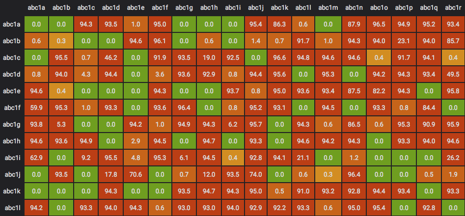

# Grafana GraLLAMA Panel


GraLLAMA is a panel plugin for Grafana which visualizes the matrix-like data
collected by the [LLAMA](https://github.com/dropbox/llama) project.

## Features
* Displays loss percentages between sources and destinations.
* Sources/Destinations are dynamically pulled from timeseries tags.
* Changes cell color based on higher percentages.



## Compatibility
This panel should work with the following datasources:
[InfluxDB](https://grafana.net/plugins/influxdb)

## Caveats
1. Colors are hard-coded currently; ranges from **green**(0%) to **red**(10%)
2. Panel setup is non-intuitive and strict (see Setup section below)

## Installation
Use the new grafana-cli tool to install grallama-panel from the commandline:

```
grafana-cli plugins install dropbox-grallama-panel
```

The plugin will be installed into your grafana plugins directory; the default
is /var/lib/grafana/plugins if you installed the grafana package.

More instructions on the cli tool can be found
[here](http://docs.grafana.org/v3.0/plugins/installation/).

You need the lastest grafana build for Grafana 3.0 to enable plugin support.
You can get it here : http://grafana.org/download/builds.html

## Setup
*TBD*
